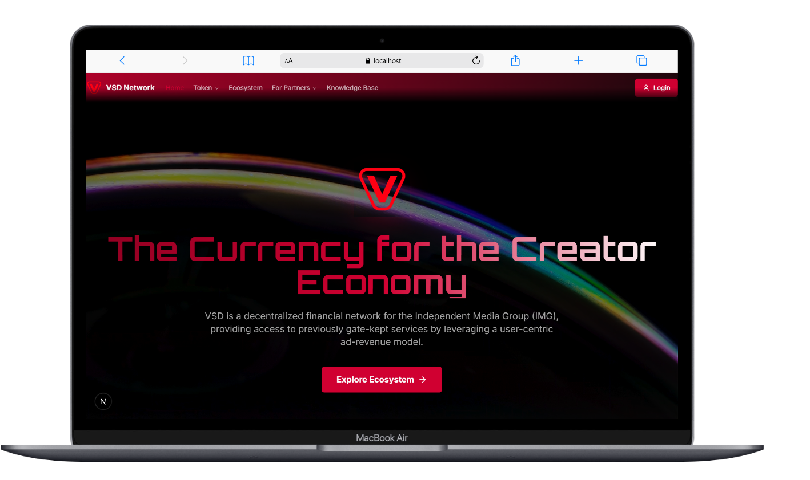
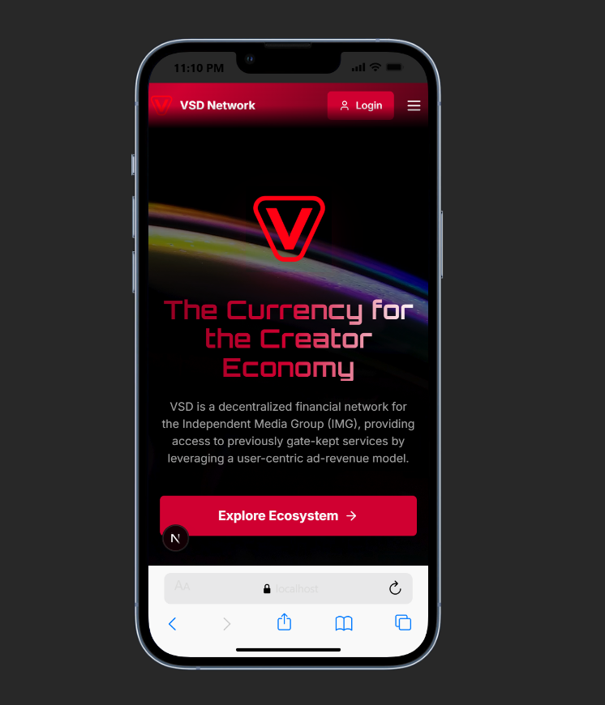

 # VSD Network - The Currency for the Creator Economy

[](https://nextjs.org/)
[](https://firebase.google.com/)
[](https://www.typescriptlang.org/)
[](https://tailwindcss.com/)

A decentralized financial platform by VSD Audio Exchange, designed to empower creators, artists, and developers by providing access to powerful AI-driven tools and services. The VSD Network leverages a user-centric ad-revenue model and its native utility token, VSD, to create a self-sustaining economy.

## 🌟 Features

- **🎨 Creator-Focused**: Built specifically for the creator economy
- **🤖 AI-Powered**: Integrated Google Genkit with Gemini for intelligent services
- **💰 Token Economy**: Native VSD utility token for transactions
- **📱 Responsive Design**: Beautiful mobile and desktop experiences
- **🔐 Secure**: Firebase authentication and Firestore security rules
- **⚡ Fast**: Next.js 15 with App Router for optimal performance

## 📸 Screenshots

### Desktop View


### Mobile View


## 🛠 Tech Stack

| Technology | Version | Description |
|------------|---------|-------------|
| **Framework** | Next.js 15 | React framework with App Router |
| **Language** | TypeScript | Type-safe JavaScript |
| **Styling** | Tailwind CSS | Utility-first CSS framework |
| **Components** | shadcn/ui | Modern React component library |
| **Animations** | Framer Motion | Production-ready motion library |
| **Backend** | Firebase | Authentication, Firestore, Hosting |
| **AI** | Google Genkit | AI flows powered by Gemini |
| **Forms** | React Hook Form | Performant forms with easy validation |
| **State** | React Hooks | Built-in React state management |

## 🚀 Quick Start

### Prerequisites

- Node.js 18.x or later
- npm or yarn package manager

### Installation

1. **Clone the repository**
   ```bash
   git clone https://github.com/shazimjaved/Vsd-nextjs-app.git
   cd Vsd-nextjs-app
   ```

2. **Install dependencies**
   ```bash
   npm install
   ```

3. **Set up environment variables**
   
   Create a `.env` file in the root directory:
   ```env
   # Internal API security key
   INTERNAL_API_KEY="your-super-secret-key"
   
   # Firebase configuration
   NEXT_PUBLIC_FIREBASE_PROJECT_ID="your-project-id"
   NEXT_PUBLIC_FIREBASE_AUTH_DOMAIN="your-project.firebaseapp.com"
   NEXT_PUBLIC_FIREBASE_API_KEY="your-api-key"
   NEXT_PUBLIC_FIREBASE_MESSAGING_SENDER_ID="your-sender-id"
   NEXT_PUBLIC_FIREBASE_APP_ID="your-app-id"
   ```

4. **Run the development server**
   ```bash
   npm run dev
   ```
   
   Open [http://localhost:9002](http://localhost:9002) to view the application.

## 📁 Project Structure

```
vsd-network/
├── src/
│   ├── app/                 # Next.js App Router pages
│   ├── components/          # Reusable React components
│   ├── ai/                  # Genkit AI flows and configurations
│   ├── firebase/            # Firebase config and custom hooks
│   ├── config/              # Site-wide configuration
│   └── lib/                 # Utility functions
├── docs/
│   └── screenshots/         # Project screenshots
├── public/                  # Static assets
├── functions/               # Firebase Cloud Functions
└── firestore.rules          # Firestore security rules
```

## 🎯 Available Scripts

| Script | Command | Description |
|--------|---------|-------------|
| **Development** | `npm run dev` | Start development server on port 9002 |
| **Build** | `npm run build` | Build application for production |
| **Production** | `npm run start` | Start production server |
| **Linting** | `npm run lint` | Run ESLint for code quality |
| **Type Check** | `npm run typecheck` | Run TypeScript compiler |
| **Testing** | `npm test` | Run tests in watch mode |
| **Deploy** | `npm run deploy` | Deploy to Firebase Hosting |

## 🔧 Development

### Code Quality

The project uses several tools to maintain code quality:

- **ESLint**: JavaScript/TypeScript linting
- **TypeScript**: Static type checking
- **Prettier**: Code formatting (configured in `.prettierrc`)

### Git Hooks

Pre-commit hooks are configured to run:
- Type checking
- Linting
- Tests

## 🚀 Deployment

### Firebase Deployment

1. **Install Firebase CLI**
   ```bash
   npm install -g firebase-tools
   ```

2. **Login to Firebase**
   ```bash
   firebase login
   ```

3. **Deploy**
   ```bash
   npm run deploy
   ```

### Environment Variables

Ensure all required environment variables are set in your Firebase hosting environment:

- `INTERNAL_API_KEY`
- `NEXT_PUBLIC_FIREBASE_*` variables

## 🤝 Contributing

1. Fork the repository
2. Create a feature branch (`git checkout -b feature/amazing-feature`)
3. Commit your changes (`git commit -m 'Add some amazing feature'`)
4. Push to the branch (`git push origin feature/amazing-feature`)
5. Open a Pull Request

### Development Guidelines

- Follow the existing code style
- Write meaningful commit messages
- Add tests for new features
- Update documentation as needed

## 🙏 Acknowledgments

- [Next.js](https://nextjs.org/) - The React framework
- [Firebase](https://firebase.google.com/) - Backend-as-a-Service platform
- [Google Genkit](https://firebase.google.com/docs/genkit) - AI framework
- [Tailwind CSS](https://tailwindcss.com/) - CSS framework
- [shadcn/ui](https://ui.shadcn.com/) - Component library

## 📞 Support

For support and questions:

- 📧 Email: shazimjaved448@gmail.com
- 🐛 Issues: [GitHub Issues](https://github.com/shazimjaved/Vsd-nextjs-app/issues)

---

<div align="center">
  <strong>Built with ❤️ and Alots of Coffee</strong>
</div>
